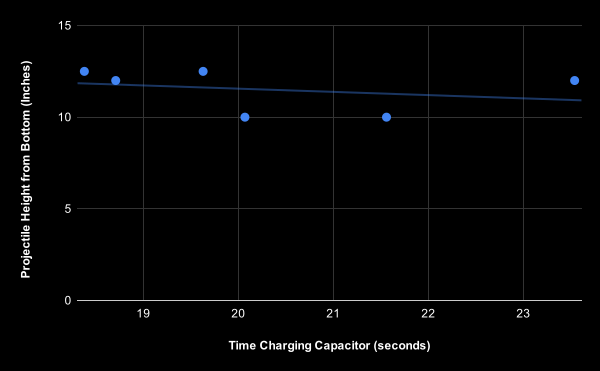

# Coilgun Adding Machine
This is an adding machine, created with coilguns, capacitor banks, and disposable charging camera circuitry. It is completely over the top, but why not have fun with it?
This project was inspired by Matthias Wandel's adding machine, that was an incredible inspiration and resource. The gates are directly inspired by his own, just slightly scaled down.   
[Original Video](https://youtu.be/GcDshWmhF4A?si=AagFJ8iIVUzHyiSO)  
[Blog post detailing its creation](https://woodgears.ca/marbleadd/more.html)  

## Part List:
- 40TPS12A Thyristor  
- 2n2222a Transistor  
- 2x 450V 68uF Capacitors  
- Usb-C Pinout Board  
- LM2596 Buck Converter (5A)  
- Disposable Camera Flash Circuitry  
- 24AWG Magnet Wire  
- MUR1560G Diode
- Arduino Uno  

> [!CAUTION]
> The Voltages needed to accelerate the projectile are dangerous and can potentially kill you. I am not saying you shouldn't experiment, but please be very cautious. Have a good multimeter, and know how to use it.

## Operating Principle of the Electronics
The USB-C is connected to power, supplying 5v, which gets converted to 4.5V with the Buck Converter. This goes to the input of the camera flash circuitry, (technically the flash circuit only accepts 1.5v, but supplying it more makes it charge faster). From there it goes to the capacitors which are wired in parallel to make a 900V Capacitor. Boom, now after about 15seconds of charging we stop, and send a signal from the arduinos digital output. But uh-oh the arduino cant trigger the beefy 40TPS12A by itself, so that gets amplified big time to 200mA with the NPN transistor. Now the signal arrives at the gate, and the once open circuit closes. In an instant the current from the capacitors flows through the thyristor into the coilgun, where it rapidly creates a powerful electromagnetic field around the coil. This Field applies force to the steel .25inch ball sitting at the base of the coil, and the force overpowers gravity accelerating the ball to the coils core. Just as quickly the voltage source shuts off, the capacitors are now empty and the ball flies into the air with velocity. But wait, what about Faradays Principle? With the voltage cut, the coil wants very badly to continue the current it was once conducting so it send a massive voltage spike in the oppposite direction to try to get some more. But now the big boy diode, which is reverse biased awakes from its sleep and the massive voltage spike is consumed as mere heat by the didoe. Just that quickly we have consumed 380V. 

## Operating Principle of the Adding Machine
As explained in Mattias's Video, the machine originally holds 0. Each gate represents a number. Starting from the right, it goes from 2^0, then the gate to its left is 2^1. The one to the left of that is 2^2. This can go on forever. By using the definition of binary numbers, we can add numbers. 
For example: We put a marble into the empty machine on the furthest gate to the right. The rocker tilts and the marble is stuck. The internal value of the machine is now 2^0 = 1. We add a marble to the second gate, and it gets stuck there. By adding this we have added 2^1 = 2, to the internal value of the machine. So in total we have 2+1=3 in value. Now adding another marble to the furthest gate to the right, and whcih tilts the rocker discarding the stuck marble, and shooting the marble to the second gate, which does the same and shoots the marble to the third gate. Now our internal value is 2^2=4. We added 2+1+1, and the machine shows the final value.

## Data Collection and optimization
Coilguns attract ferromagnetic objects to their core while they have current. This is great although if we get our projectile to get attracted to the core, and have velocity but then be pulled backwards by the coilgun. So we need to precisely time when we shut voltage off, so we dont pull our projectile backwards. In lieu of a IR system, to measure the interruption, I decided to precisely time the charging of capacitor, so they will simply run out of voltage when the projectile is at its core and no longer should have an attraction. By measuring the time the projectile charged for, the voltage of the capacitor, and the height the projectile went I came up with this graph. I was charging the capacitors externally with the flash circuit, and manually timing everything, so there might be imprecision, but it gives a rough estimate of where we need to be.
_A quick note about why I decided to use time instead of voltages to trigger the discharge. I created several iterations of voltage dividers that connected the capacitor to an arduino analog pin. I was able to sucessfully read capacitor voltages, but doing this made a slow bleed from the resistors, which interfered with the charging circuit._

## Raw Data
| Voltage (V) | Time (sec) | Height (in) |
|------------|-----------|------------|
| 363        | 19.63     | 12.5       |
| 469        | 23.54     | 12         |
| 444        | 21.56     | 10         |
| 421        | 20.07     | 10         |
| 375        | 18.38     | 12.5       |
| 408        | 18.71     | 12         |

## Graph

With this data we can conclude somewhere around 18 seconds of charging gives the ideal height. Voltages of 360-375 seemed perfect. 
Now I will add a relay to my circuit so the arduino can precisely control charging and I can run precise experiments with the timing.

