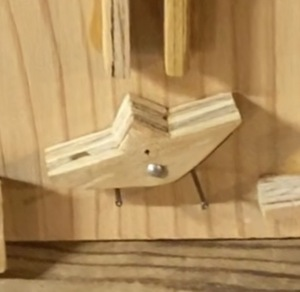
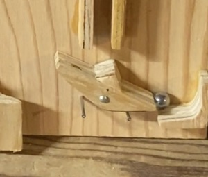

# Coilgun Adding Machine
This is an adding machine, which uses coilguns to carry digits.  
This project was inspired by Matthias Wandel's adding machine, whose posts were an incredible inspiration and resource.  
  
- [Marble adding machine by Matthias Wandel](https://youtu.be/GcDshWmhF4A?si=AagFJ8iIVUzHyiSO)  
- [Further information from his blog](https://woodgears.ca/marbleadd/more.html)  
 
 
## TL;DR
The machine is an analog computer that uses marbles to represent bits, and coilguns that shoots the marbles to other columns to carry digits when a bit overflows.  
  
  

## FAQ
How does the machine store value?
When the gate is tilted to the left, it has no value. This is the position that all of the gates of the machine start in. 
   

When the gate is tilted to the right, it is storing a value. To determine the value in base 10, you must count how far you are from the far right. The count starts at 0. If this gate was the one furthest to the right, it would be gate 0. 20 is 1, so when that gate is tilted to the right, its value is 1. 
    
    

   
# Build Instructions  

 
> [!CAUTION]
> The voltages needed to accelerate the projectile extremely dangerous and can potentially kill you. I am not saying you shouldn't experiment, but please be very cautious. Have a good multimeter, and know how to use it.

## Part List:
- 40TPS12A Thyristor  
- 2n2222a Transistor  
- 2x 450V 68uF Capacitors  
- USB-C Pinout Board  
- LM2596 Buck Converter (5A)  
- Disposable Camera Flash Circuitry [^1]  
- 24AWG Magnet Wire  
- MUR1560G Diode
- Arduino Uno
- 2x 5v DC Relays  

  
## How to prepare the disposable camera
You will need to completly strip the disposable camera of its housing, I did this by jamming a flat head screwdriver in the side, cutting all the adhesive holding it together and then popping the clips. The board is basically the only electronic component in the whole thing, so it should be easy to see. You should see a cylindrical capacitor connected to the board. Measure the voltage, and if it is charged (carefully) discharge it with a screwdriver that has a non metallic handle. Then pop out the entire module gently. Mark the board on the connector that the capacitors stripe is. That is the negative output terminal. Now desolder the capacitor, and set it to the side. I did not use the capacitor as it didnt have enough voltage for my project, but it is still a useful component. The next is figuring out how make your board stay triggered. Some have a button that you can pry off, then scratch the pcb coating off to bridge the pins, others you can solder the moveable component in place to permanently set it. 

## Operating Principle of the Electronics
The USB-C is connected to power, supplying 5v, which gets converted to 4.5V with the Buck Converter. This goes to the input of the camera flash circuitry, (technically the flash circuit only accepts 1.5v, but supplying it more makes it charge faster). From there it goes to the capacitors which are wired in parallel to make a 900V Capacitor. Boom, now after about 15seconds of charging we stop, and send a signal from the arduinos digital output. But uh-oh the arduino cant trigger the beefy 40TPS12A by itself, so that gets amplified big time to 200mA with the NPN transistor. Now the signal arrives at the gate, and the once open circuit closes. In an instant the current from the capacitors flows through the thyristor into the coilgun, where it rapidly creates a powerful electromagnetic field around the coil. This Field applies force to the steel .25inch ball sitting at the base of the coil, and the force overpowers gravity accelerating the ball to the coils core. Just as quickly the voltage source shuts off, the capacitors are now empty and the ball flies into the air with velocity. But wait, what about Faradays Principle? With the voltage cut, the coil wants very badly to continue the current it was once conducting so it send a massive voltage spike in the oppposite direction to try to get some more. But now the big boy diode, which is reverse biased awakes from its sleep and the massive voltage spike is consumed as mere heat by the didoe. Just that quickly we have consumed 380V. 

## Operating Principle of the Adding Machine
As explained in Mattias's Video, the machine originally holds 0. Each gate represents a number. Starting from the right, it goes from 2^0, then the gate to its left is 2^1. The one to the left of that is 2^2. This can go on forever. By using the definition of binary numbers, we can add numbers. 
For example: We put a marble into the empty machine on the furthest gate to the right. The rocker tilts and the marble is stuck. The internal value of the machine is now 2^0 = 1. We add a marble to the second gate, and it gets stuck there. By adding this we have added 2^1 = 2, to the internal value of the machine. So in total we have 2+1=3 in value. Now adding another marble to the furthest gate to the right, and whcih tilts the rocker discarding the stuck marble, and shooting the marble to the second gate, which does the same and shoots the marble to the third gate. Now our internal value is 2^2=4. We added 2+1+1, and the machine shows the final value.

## Data Collection and optimization
Coilguns attract ferromagnetic objects to their core while they have current. This is great although if we get our projectile to get attracted to the core, and have velocity but then be pulled backwards by the coilgun. So we need to precisely time when we shut voltage off, so we dont pull our projectile backwards. In lieu of a IR system, to measure the interruption, I decided to precisely time the charging of capacitor, so they will simply run out of voltage when the projectile is at its core and no longer should have an attraction. By measuring the time the projectile charged for, the voltage of the capacitor, and the height the projectile went I came up with this graph. I was charging the capacitors externally with the flash circuit, and manually timing everything, so there might be imprecision, but it gives a rough estimate of where we need to be.  
A quick note about why I decided to use time instead of voltages to trigger the discharge: I created several iterations of voltage dividers that connected the capacitor to an arduino analog pin. I was able to sucessfully read capacitor voltages, but doing this made a slow bleed from the resistors, which interfered with the charging circuit.

## Raw Data
| Voltage (V) | Time (sec) | Height (in) |
|------------|-----------|------------|
| 363        | 19.63     | 12.5       |
| 469        | 23.54     | 12         |
| 444        | 21.56     | 10         |
| 421        | 20.07     | 10         |
| 375        | 18.38     | 12.5       |
| 408        | 18.71     | 12         |

## Graph

With this data we can conclude somewhere around 18 seconds of charging gives the ideal height. Voltages of 360-375 seemed perfect. 
Now I will add a relay to my circuit so the arduino can precisely control charging and I can run precise experiments with the timing.

[^1]: How do you get disposable camera circuitry for free? Used disposable cameras have a lot of handy parts, like a high voltage capacitor, and circuitry that steps up 1.5v to 363v. That circuitry is very helpful and I use it in this build. To get them for free, I found places that sell and process film from disposable cameras around me, and went in and asked for them. They were more than happy to give them out to me, and i've tried this at a few spots, where I often got 30 used cameras per visit. Primarily I use the flash circuitry from FujiFilm QuickSnaps, as they are reliable and plentiful. 
